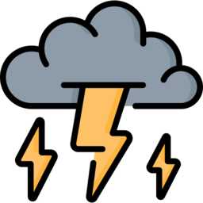

# 🌧 RainViewer Storm Detector — Home Assistant Integration

[](https://github.com/hacs/integration)
[](https://github.com/miplatas/rainviewer-hacs/releases)
[](LICENSE)

A Home Assistant integration that detects storm conditions using **RainViewer** radar images and automatically publishes data to **MQTT**.

---

## ✨ Features

- 📡 Real-time radar image analysis (RainViewer API — free, no API key required)
- ⚡ Automatic publishing to MQTT (`rainviewer/status` and `rainviewer/alert`)
- 🏠 Sensors created automatically in Home Assistant — no YAML needed
- 🔧 Fully configurable from the UI (no `configuration.yaml` editing required)
- 🌍 Radar tile calculated automatically from XYZ tile format
- 📊 14 state sensors + 4 binary sensors

## 🌍 XYZ Tile Format

This application utilizes the **XYZ tile format**, more commonly known as the **Slippy Map** coordinate system. It is the standard format used by OpenStreetMap, Google Maps, and most other web mapping platforms.

The structure of the URL always follows this pattern:
`.../{z}/{x}/{y}.png`

### Example: Northeast Mexico
**URL:** [https://a.tile.openstreetmap.org/7/28/54.png](https://a.tile.openstreetmap.org/7/28/54.png)

In this specific example (`7/28/54.png`), the coordinates break down as follows:

* **7 (z - Zoom Level):** The level of detail. Zoom level `0` shows the entire world on a single tile, while zoom level `7` shows a regional view (e.g., a country or large state).
* **28 (x - Column):** The horizontal coordinate. The grid starts at `0` at the western edge of the map (180° W) and increases moving East.
* **54 (y - Row):** The vertical coordinate. The grid starts at `0` at the northern edge of the map (85.0511° N) and increases moving South.

> [!TIP]
> Before completing your configuration, please verify that your specific `{z}/{x}/{y}` coordinates reflect the correct location by testing the URL `https://a.tile.openstreetmap.org/{z}/{x}/{y}.png` in your browser for a given `x`, `y`, `z`.

---

## 📦 Installation via HACS

### Recommended method

1. In Home Assistant, go to **HACS → Integrations → ⋮ → Custom repositories**
2. Add the URL: `https://github.com/miplatas/rainviewer-hacs`
3. Category: **Integration**
4. Search for **RainViewer Storm Detector** and click **Download**
5. Restart Home Assistant

### Manual method

1. Copy the `custom_components/rainviewer` folder to your `config/custom_components/` directory
2. Restart Home Assistant

---

## ⚙️ Configuration

1. Go to **Settings → Devices & Services → Add Integration**
2. Search for **RainViewer Storm Detector**
3. Fill in the form:

| Field | Description | Default |
|---|---|---|
| Latitude | Your location latitude | HA location |
| Longitude | Your location longitude | HA location |
| Zoom | Radar zoom level (6–8) | 7 |
| Tile X | Radar tile X (auto-calculated) | auto |
| Tile Y | Radar tile Y (auto-calculated) | auto |
| MQTT Broker | Broker IP or hostname | — |
| MQTT Port | Broker port | 1883 |
| MQTT Username | (optional) | — |
| MQTT Password | (optional) | — |
| Scan interval (s) | How often to analyze | 300 |
| Rain threshold | Minimum pixel fraction for rain | 0.005 |
| Hail threshold | Minimum pixel fraction for hail | 0.001 |
| Alert distance | Maximum distance in pixels | 30 |

---

## 🌡 Sensors created automatically

### State sensors (`sensor.*`)

| Entity | Description |
|---|---|
| `sensor.rainviewer_alert_level` | Alert level: `none` / `watch` / `warning` / `emergency` |
| `sensor.rainviewer_alert_message` | Human-readable alert description |
| `sensor.rainviewer_rain_coverage` | % of pixels with rain |
| `sensor.rainviewer_heavy_rain_coverage` | % of pixels with heavy rain |
| `sensor.rainviewer_hail_coverage` | % of pixels with hail |
| `sensor.rainviewer_rain_trend` | Rain trend (positive = increasing) |
| `sensor.rainviewer_hail_trend` | Hail trend |
| `sensor.rainviewer_storm_distance` | Estimated storm distance (pixels) |
| `sensor.rainviewer_dbz_mean` | Mean dBZ of the last frame |
| `sensor.rainviewer_dbz_max` | Max dBZ of the last frame |
| `sensor.rainviewer_storm_movement_x` | Horizontal storm movement vector |
| `sensor.rainviewer_storm_movement_y` | Vertical storm movement vector |
| `sensor.rainviewer_last_radar_image_url` | PNG URL of the last analyzed radar frame |
| `sensor.rainviewer_last_radar_time` | Human-readable timestamp of the last radar frame |

### Camera (`camera.*`)

| Entity | Description |
|---|---|
| `camera.rainviewer_radar_image` | Composite image: OSM map + radar overlay + home icon. Keeps a buffer of the last N analyzed frames. |

### Binary sensors (`binary_sensor.*`)

| Entity | Description |
|---|---|
| `binary_sensor.rainviewer_rain_detected` | `on` when rain is detected |
| `binary_sensor.rainviewer_hail_detected` | `on` when hail is detected |
| `binary_sensor.rainviewer_storm_approaching` | `on` when storm is approaching |
| `binary_sensor.rainviewer_emergency_alert` | `on` on emergency alert |

---

## 📨 MQTT Topics

| Topic | When published |
|---|---|
| `rainviewer/status` | Every analysis cycle |
| `rainviewer/alert` | Only when `alert != "none"` |

### Example JSON payload

```json
{
  "timestamp": 1746100000,
  "location": {"lat": 19.4326, "lon": -99.1332},
  "alert": "warning",
  "alert_msg": "Heavy rain approaching",
  "last_radar_url": "https://tilecache.rainviewer.com/.../256/7/28/54/8/1_1.png",
  "last_radar_time": "2025-05-01 14:30:00 UTC",
  "current": {"rain": 0.012, "hail": 0.002, "heavy": 0.008},
  "trend": {"rain": 0.003, "hail": 0.001},
  "movement": {"vx": -1.2, "vy": 0.8, "distance": 22.5, "approaching": true},
  "frames": [...]
}
```

---

## 🔔 Automation example

```yaml
automation:
  - alias: "Storm Alert"
    trigger:
      - platform: state
        entity_id: binary_sensor.rainviewer_emergency_alert
        to: "on"
    action:
      - service: notify.mobile_app
        data:
          title: "⚠️ Storm Warning"
          message: "{{ states('sensor.rainviewer_alert_message') }}"
```

---

## 📝 Alert levels

| Level | Condition |
|---|---|
| `none` | No significant precipitation |
| `watch` | Moderate rain detected |
| `warning` | Heavy rain or hail in the region |
| `emergency` | Hail or heavy rain approaching your location |

---

## 🛠 Dependencies

The following libraries are installed automatically:
- `requests`
- `Pillow`
- `numpy`
- `paho-mqtt`

---

## 📄 License

MIT License — see [LICENSE](LICENSE)
